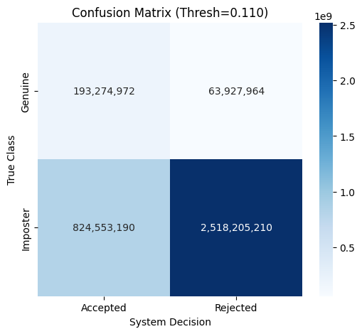

251214_2001

## views:


## terminal
```bash
$ python -m ttv.tgm > t_tgm-251214_2001
<frozen runpy>:128: RuntimeWarning: 'ttv.tgm' found in sys.modules after import of package 'ttv', but prior to execution of 'ttv.tgm'; this may result in unpredictable behaviour
INFO:Trainer:Starting Training on: cuda
INFO:Trainer:Loading .pt files from: verf/processed_tensors
Loading Data: 100%|███████████████████████████████████████████| 84/84 [00:22<00:00,  3.66it/s]
INFO:Trainer:Saved 14 test subjects to verf/test_subjects-251214_2001.txt
INFO:Trainer:Split: Train=58, Val=12
INFO:Trainer:No resume (starting fresh).
INFO:Trainer:Saving best checkpoint to: verf/ttv/new/best_gait_model-251214_2001.pth
INFO:Trainer:Beginning 30 epochs...
INFO:Trainer:Epoch [1/30] Train: 0.0029 | Val: 0.0462 | 1537.8s                               
INFO:Trainer:--> New Best Model Saved! (Loss: 0.0462)
Epoch 2:   2%|▊                                           | 299/15229 [00:27<24:03, 10.34it/s]Traceback (most recent call 
```

## Testing:


FINAL EER: 24.74%
Threshold: 0.1099


