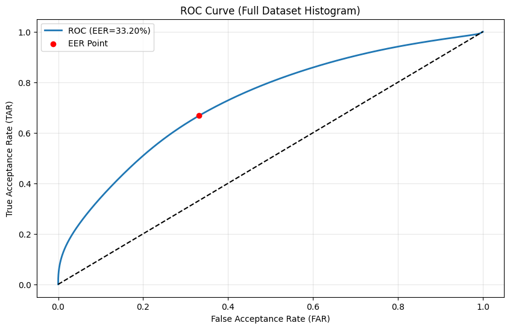
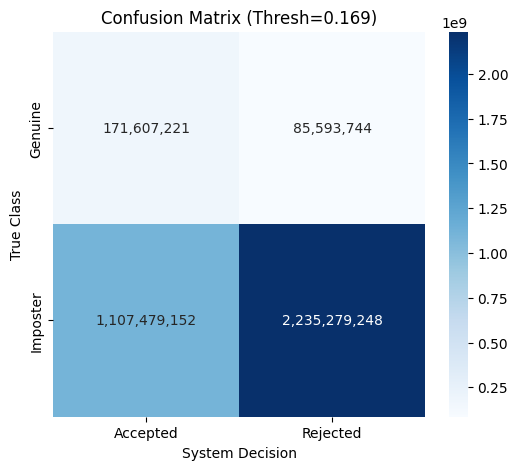

251214_2041

## notes:
- overloaded the cpu too much

## Terminal:
``` bash
 python -m ttv.tgm > t_tgm-251214_2041.md
INFO:Trainer:Starting Training on: cuda
INFO:Trainer:Loading .pt files from: verf/processed_tensors
Loading Data: 100%|███████████████████████████████████████████| 84/84 [00:27<00:00,  3.02it/s]
INFO:Trainer:Saved 14 test subjects to verf/test_subjects-251214_2041.txt
INFO:Trainer:Split: Train=58, Val=12
INFO:Trainer:No resume (starting fresh).
INFO:Trainer:Saving best checkpoint to: verf/ttv/new/best_gait_model-251214_2041.pth
INFO:Trainer:Beginning 30 epochs...
INFO:Trainer:Epoch [1/30] Train: 0.0037 | Val: 0.0460 | 556.0s                                
INFO:Trainer:--> New Best Model Saved! (Loss: 0.0460)
INFO:Trainer:Epoch [2/30] Train: 0.0000 | Val: 0.0490 | 356.8s
```

## Test:

FINAL EER: 33.20%
Threshold: 0.1689



