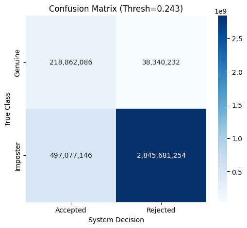
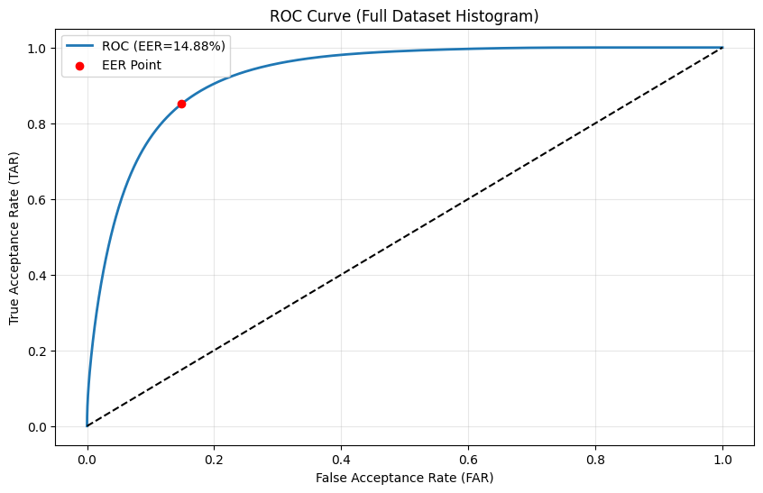

251214_1829
## views

## Terminal
```bash
$ python -m ttv.tgm > t_tgm-251214_1830
<frozen runpy>:128: RuntimeWarning: 'ttv.tgm' found in sys.modules after import of package 'ttv', but prior to execution of 'ttv.tgm'; this may result in unpredictable behaviour
INFO:Trainer:Starting Training on: cuda
INFO:Trainer:Loading .pt files from: /home/adhyeta/0zProject/verf/processed_tensors
Loading Data: 100%|███████████████████████████████████████████| 84/84 [00:29<00:00,  2.82it/s]
INFO:Trainer:Saved 14 test subjects to /home/adhyeta/0zProject/verf/test_subjects-251214_1829.txt
INFO:Trainer:Split: Train=58, Val=12
INFO:Trainer:No resume (starting fresh).
INFO:Trainer:Saving best checkpoint to: /home/adhyeta/0zProject/verf/best_gait_model-251214_1829.pth
INFO:Trainer:Beginning 30 epochs...
INFO:Trainer:Epoch [1/30] Train: 0.0230 | Val: 0.0633 | 543.5s                                
INFO:Trainer:--> New Best Model Saved! (Loss: 0.0633)
INFO:Trainer:Epoch [2/30] Train: 0.0131 | Val: 0.0620 | 540.2s                                
INFO:Trainer:--> New Best Model Saved! (Loss: 0.0620)
INFO:Trainer:Epoch [3/30] Train: 0.0113 | Val: 0.0656 | 419.0s                                
INFO:Trainer:Epoch [4/30] Train: 0.0104 | Val: 0.0662 | 424.7s                                
INFO:Trainer:Epoch [5/30] Train: 0.0099 | Val: 0.0646 | 342.1s                                
Epoch 6:  59%|█████████████████████████▍                 | 9014/15229 


FINAL EER: 14.88%
Threshold: 0.2433

```
## Testing:

===================================
FINAL EER: 14.88%
Threshold: 0.2433
===================================


