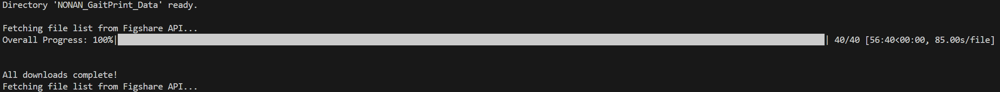

notes:

> had to make 2 seprate downloader filles beacuse of the different format of file structure via the api call

## DL_01.py

downloaded the Young adult dataset using the dl_01.py

---

## DL_02.py
